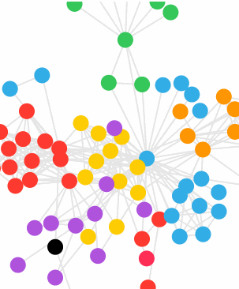

# Force-directed Graph Layout

This repo SwiftUI implementation of a forced directed graph simulation.  I used it for 
[A Flock of Swifts](http://aflockofswifts.org/) presentation.  

Now using `Canvas` and `TimelineView`.

